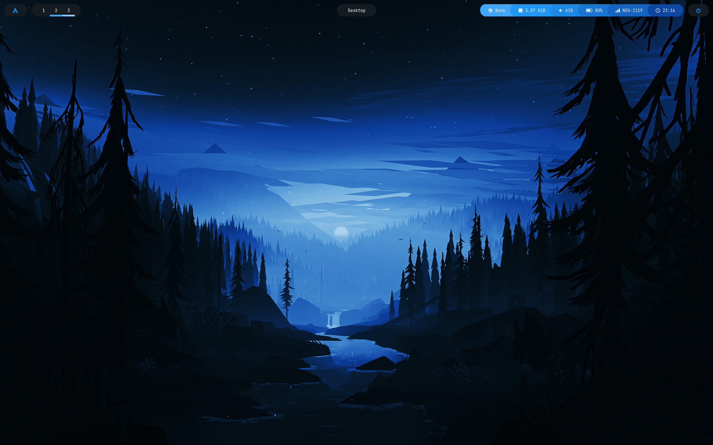
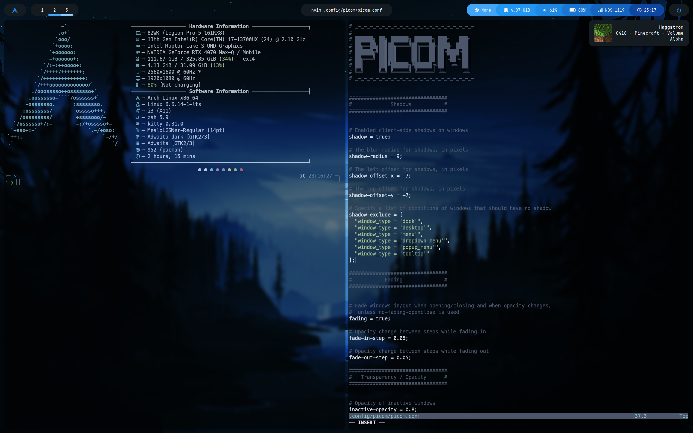
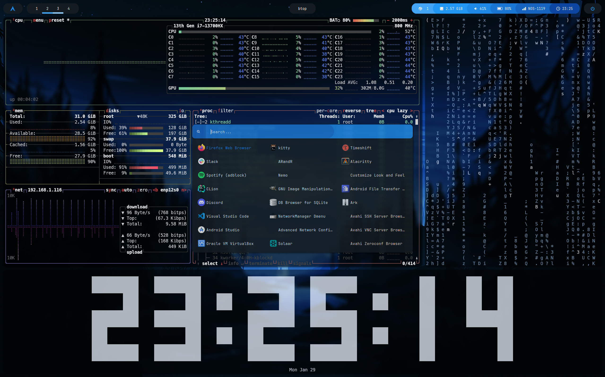

# 🪄 My Arch Linux Dotfiles

### 📸 Screenshots

### ⚡ Info

 - **Window Manager:** [`i3`](https://i3wm.org/)
 - **Terminal Emulator:** [`kitty`](https://sw.kovidgoyal.net/kitty/)
 - **Shell:** [`Zsh`](https://www.zsh.org/)
   - **Plugin Manager:** [`oh-my-zsh`](https://github.com/ohmyzsh/ohmyzsh)
   - **Plugins:** [`powerlevel10k`](https://github.com/romkatv/powerlevel10k), [`zsh-autosuggestions`](https://github.com/zsh-users/zsh-autosuggestions), [`zsh-syntax-highlighting`](https://github.com/zsh-users/zsh-syntax-highlighting)
 - **System Information Tool:** [`fastfetch`]()
 - **Compositor:** [`picom`](https://github.com/yshui/picom)
 - **Status Bar:** [`polybar`](https://github.com/polybar/polybar)
 - **Launcher:** [`rofi`](https://github.com/davatorium/rofi)
 - **Screen Locker:** [`i3lock-color`](https://github.com/Raymo111/i3lock-color)
 - **Login Manager:** [`SDDM`](https://github.com/sddm/sddm/) with [`Sugar Candy`](https://framagit.org/MarianArlt/sddm-sugar-candy)
 - **GTK Theme:** [`Adwaita/Adwaita-dark`](https://gnome.pages.gitlab.gnome.org/libadwaita/)
 - **Primary Fonts**: [`JetBrainsMono Nerd Font`](https://www.nerdfonts.com/#home), [`MesloLGS Nerd Font`](https://www.nerdfonts.com/#home)
 - **Browser:** [`Firefox`](https://www.mozilla.org/pt-PT/firefox/browsers/)
 - **Text Editors:** [`vim`](https://www.vim.org/), [`neovim`](https://neovim.io/), [`VSCode`](https://code.visualstudio.com/)
 - **File Manager** [`nemo`](https://github.com/linuxmint/nemo)
 - **Notification Daemon:** [`dunst`](https://dunst-project.org/)
 - **Image Viewer:** [`feh`](https://feh.finalrewind.org/)
 - **System Monitor:** [`btop`](https://github.com/aristocratos/btop)
 - **Others:** [`cmatrix`](https://www.asty.org/cmatrix/), [`peaclock`](https://github.com/octobanana/peaclock), [`cava`](https://github.com/karlstav/cava)

### 📜 Installation Script

To easily setup the dotfiles, clone the repository and run the script [`setup.sh`](setup.sh) in the root of the repository folder. It is meant to be executed after a fresh, minimal installation of Arch Linux.

**NOTE:** Some configurations are adjusted to my personal computer (network devices, resolution, ...), make sure to adjust them to your own needs. Also, the dotfiles don't work well in VMs (one reason being `picom` because it uses `glx` as the backend, just change to `xrender` in `picom.conf`)